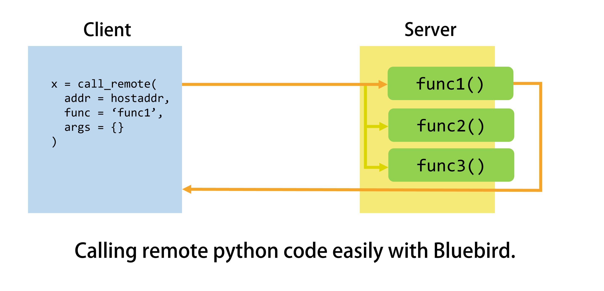

# Bluebird
**Bluebird: Lightweight Python Network Programming Interface**


## Introduction
In many network-based applications, we need to access and leverage the computation resources on a remote device. 
Such a requirement can make the programming quite difficult. This is in particular undesirable for the python programming, where we focus more on the application logic.

We would like to call a function on a remote server in a neat way like:
```
>>> call_remote(host='localhost', port=12345, 
                     function=add, args={'a': 1, 'b': 2})
3
```
This is also called remote procedure call (RPC). We develop the Bluebird, an extremely lightweight implementation of RPC. It enables us to write network-based python program and do customization easily.


## Examples
Here, we provide some examples. You can find them in the ``./example`` folder.

### Helloworld: A+B Program
We first present a very simple A+B program as quickstart.

**Code on the server side**:
```python
from bluebird import FunctionServer
import numpy as np

def add(a, b):
    return a + b

def minus(a, b):
    return a - b

if __name__ == '__main__':
    server = FunctionServer(host='localhost', port=12345)
    server.function_handler.add_func('add', add)
    server.function_handler.add_func('minus', minus)
    server.run()

```
On the server side, we first define functions (add and minus) that we would like to expose on the internet. Then, we open a ``FunctionServer`` and add these two functions to the function server. That is all we need on the server side.

**Code on the client side**:
```python
from bluebird import call_remote_func
import numpy as np

if __name__ == '__main__':
    result = call_remote_func(host = 'localhost', 
                              port = 12345,
                              func = 'add', 
                              args = {'a': np.array([1., 2.]), 'b': np.array([3., 4.])})
	
    print(result)

```
On the client side, we simply need to wrap up the function in ``call_remote_func``, in which we tell the address of the server (i.e., host and port) in addition.

**Try out the example**

To run this example, we first run
```bash
python ./example/a_plus_b/server.py
```
Then we open another terminal, run
```bash
python ./example/a_plus_b/client.py
```

### Using Classes: Logger Server
On the server side, we would also like to go beyond simple functions and wrap the calculation in classes.
Therefore, we provide a logger server example here.

**Code on the server side**:
```python
from bluebird import FunctionServer, FunctionHandler


class LoggerFunctionHandler(FunctionHandler):
    def __init__(self):
        super(LoggerFunctionHandler, self).__init__()
        self.logs = []

    def init_class_function(self):
        self.add_class_func('add_log', self.add_log)
        self.add_class_func('get_log', self.get_log)
    
    def add_log(self, log):
        self.logs.append(log)
    
    def get_log(self, n=5):
        return self.logs[-n:]


if __name__ == '__main__':
    server = FunctionServer(host = 'localhost', port = 12345)
    server.function_handler = LoggerFunctionHandler()
    server.run()
```
We customize a function handler and add the logging functions to it. Then we set the FunctionServer's handler to this new function handler.

**Code on the client side**:
```python
from bluebird import call_remote_func
import time


if __name__ == '__main__':
    call_remote_func(host='localhost', port=12345, func='add_log', args={'log': 'hello'})
    call_remote_func(host='localhost', port=12345, func='add_log', args={'log': 'it\'s me'})
    time.sleep(5)

    logs = call_remote_func(host='localhost', port=12345, func='get_log', args={'n': 100})
    print(logs)
```
On the client side, we can call the class method in the same way like the A+B program. We first write 2 log lines, sleep for 5 seconds, and then retrieve the log.

**Try out the example**

To run this example, we first run
```bash
python ./example/log_server/server.py
```
Then we open another terminal, run
```bash
python ./example/log_server/client.py
```
We can see that the client is able to get the log correctly. Moreover, if we run the ``client.py`` for multiple times, we can find the log accumulating.

### Specifying proper buffersize.
In some applications, the size of transmitted data can be very large (e.g.). We need to specify a proper send buffersize for efficient data transmission. We present an image processing example in ``./example/image_processing``, in which you can find we specify the buffersize to ``65536``, rather than the default value ``1024``.

You can compare the execution speed of setting buffersize to different values.

## Misc
At current stage, this is an experimental interface. It is suitable for prototyping and simple applications, but not ready for scaled application since some advanced features like non-blocking IO has not been added yet. Moreover, we also need some proper error handling, like dealing with timeout.

You are welcome to contribute to this project! 🙂
